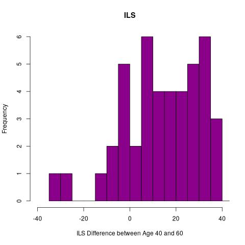
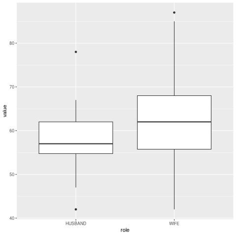

# Book Exercises 3

## Lesson 22

### Lesson 22.1 through Lesson 22.4 

One sample t-test executed with test value of "50"

`t.test(lesson22_data, mu = 50)`

Output is 

```
t = 2.4573, df = 29, p-value = 0.02022
alternative hypothesis: true mean is not equal to 50
95 percent confidence interval:
 50.77704 58.48963
sample estimates:
mean of x 
 54.63333 
```
meaning that the p value is .02, 

d is therefore = t/sqrt(N) = 2.4573 / sqrt(30) = 0.448639546852 or *0.45*

### Lesson 22 Exercises

1. Total Scores Computed by summing items 1 through 8
2. We'll use the "chance" value as the test value.  Thus, the test value for this problem is 2 because with four possible choices the chance of correctly guessing the answer is 25%; with eight problems, the expected chance score is "2"
3. To conduct the one-sample t test I ran 

`t.test(lesson22_exercise1_data$total_score, mu = 2)` 

receiving the output

```
data:  lesson22_exercise1_data
t = -2.7681, df = 53, p-value = 0.007749
alternative hypothesis: true mean is not equal to 2
95 percent confidence interval:
 0.8502799 1.8163868
sample estimates:
mean of x 
 1.333333 
```

Mean = 6
t test value = 6.93
p value = .0009

d = t/sqrt(N) = 6.93 / sqrt(8) = 2.45

4. A one-sample t test was conducted to evalute whether the mean total algebra score was significantly different than the chance value of 2.  The sample mean of 6 was significantly different 2, t(5) = 6.93, p=0.0009.   The 95% confidence internal for ranged from 4.51 to 7.48.  The effect size was 2.45 indiciating a strong effect.  With a p value so low and an exceptionally high t value, we reject the null hypothesis and conclude that the teaching technique was assocated with the increased score. 


5. T-test; midpoint 5
mean = 8.75
t test value = 3.54
p value = .002
d = .79

The sample mean of happiness scores was 8.75 for the combined classical music happiness scores.  A one-sample t test was conduced to evalute whether this mean was significantly different than the midpoint value of 5.  The sample was found to be significantly different than 5, t(19) = 3.54, p=.002.  The effect size was df= .79, showed a moderate effect.  The 95% confidence level ranged from 6.53 to 10.96.  With a p value well below .05, at .002, and a t value outside +/- 2.09, our we reject the null hypothesis and conclude that the classical music was associated with the students feeling happiness.

## Lesson 23

### Lesson 23.1 through Lesson 23.4 

Paired t test 

`t.test(lesson23_data$PAY, lesson23_data$SECURITY, paired = TRUE)`

gives the output

```
        Paired t-test

data:  lesson23_data$PAY and lesson23_data$SECURITY
t = 2.827, df = 29, p-value = 0.008426
alternative hypothesis: true mean difference is not equal to 0
95 percent confidence interval:
 0.322637 2.010696
sample estimates:
mean difference 
       1.166667 
```

### Lesson 23 Exercises
1. Computed scores by adding the interpersonal and occupational life stress scores for each age
2. Computed using `t.test(lesson23_exercise1_data$ILS_40, lesson23_exercise1_data$ILS_60, paired=TRUE)`
3. 
4. Separate paired t tests conducted on the stress variables
5. Several paired t-tests were executed to evalute if stress levels change for women over time. The results indicated that the mean occupational stress at age 40 (M=73.64) was significantly greater than the mean occupational stress at age 60 (M=61.87), t(44)=6.22, p=1.58x10^7.  The standardized effective size, d, was .92 indicating a strong effect.  The 95% confidence interval was 7.96 to 15.59.  As a result we reject the null hypothesis and concluded that significant differences occur in occupational stress for women from age 40 to age 60.  
However, for interpersonal stress, t(44)=1.54, p=.13, we cannot reject the null hypothesis.  While the means at age 40 (M=78.2) is different from age 60 (M=75), it's not clear is this is significant.

6. Husbands M=57.46
   Wives M=62.54
7. A paired t test was conducted to evaluate if husbands and wives feel equally anxious during infertility problems.  The mean stress score for husbands was M=57.46 and for wives M=62.54.  The results indicated that a sigificant difference exists between the means, t(23)=-3.25, p=.003.  The effect size was moderate at d=-.66.  
8. 

### Lesson 24

Two indepedent t tests assuming and not assuming equal variables using

```
t.test(TALK ~ STRESS, data = lesson24_data, var.equal=TRUE)

t.test(TALK ~ STRESS, data = lesson24_data, var.equal=FALSE)
```

Output

```
        Two Sample t-test

data:  TALK by STRESS
t = 2.4297, df = 28, p-value = 0.02178
alternative hypothesis: true difference in means between group 1 and group 2 is not equal to 0
95 percent confidence interval:
  3.629962 42.636705
sample estimates:
mean in group 1 mean in group 2 
       45.20000        22.06667 


        Welch Two Sample t-test

data:  TALK by STRESS
t = 2.4297, df = 27.808, p-value = 0.02183
alternative hypothesis: true difference in means between group 1 and group 2 is not equal to 0
95 percent confidence interval:
  3.623904 42.642763
sample estimates:
mean in group 1 mean in group 2 
       45.20000        22.06667 
```

### Lesson 24 Exercises 1-5

1. - Assuming Equal Variances: t(38)=-3.975, p = .0003
   - Not Assuming Equal Variances: t(38)=-5.3966, p=7x10^-6
2. - Mean eating time of overweight: 589
   - standard deviation normal weight: 82.84
   - results for test evaluating homogeneity of variances.
3. effect size = -1.45 [N1=10, N2=30]
4. An independent-samples test was conducted to evaluate the hypothesis that overweight diners eat more quickly. The test was significant, t(38)=-3.98, p=.0003,  but the results were counter to the research hypothesis. Diners in the overweight were  . The confidence interval for the difference in means was quite wide, ranging from -165 to -53. The effect size was sigificant at -1.45.


### Lesson 24 Exercises 6-10
In progress
